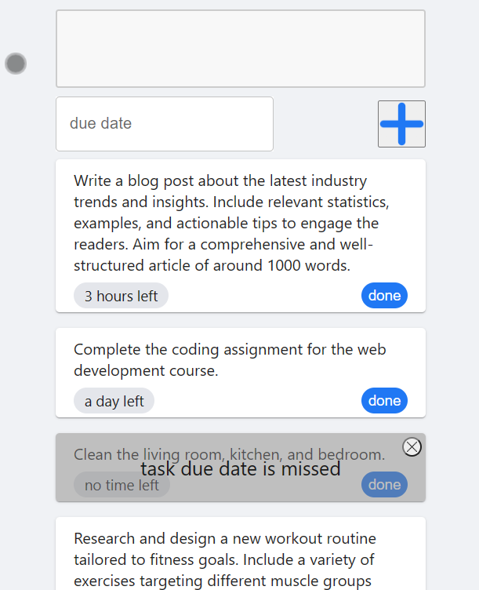

# To-Do App
A simple responsive to-do list application built with React to help you stay organized.




## Table of Contents
- [Demo](#demo)
- [Features](#features)
- [Installation](#installation)


## Demo

Check out the live demo: [To-Do App Demo](https://laktam.github.io/to-do-app)

## Features

- Add new tasks with due dates and descriptions.
- Mark tasks as done
- Overdue task indicator highlights tasks with missed due dates.  


## Installation

### Prerequisites

Before you begin, make sure you have the following installed:

- Node.js: [Download Node.js](https://nodejs.org/)
- npm (Node Package Manager): npm is included with Node.js installation.


### Clone the Repository

1. Clone the repository to your local machine:

```bash
git clone https://github.com/laktam/to-do-app.git
```
2. Navigate to the project directory:

 ```bash
cd your-project
   ```
3. Install Dependencies
Use npm to install the project's dependencies:

 ```bash
npm install
   ```
4. Start the Development Server
To launch the development server and view the app in your browser, run:

```bash
npm start
```
The development server will start, and the app will be accessible at http://localhost:3000. Any changes you make to the source code will automatically trigger a hot reload.

5. Build for Production
When you're ready to deploy the app to a production environment, create a production build using:

```bash 
npm run build
```
The optimized and minified build will be created in the build folder.
